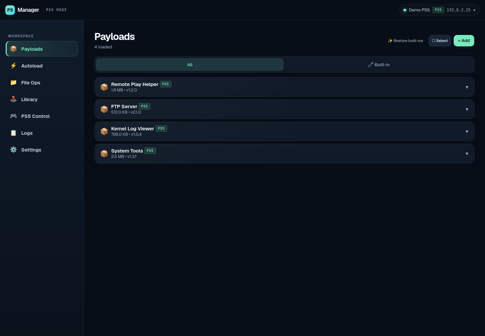
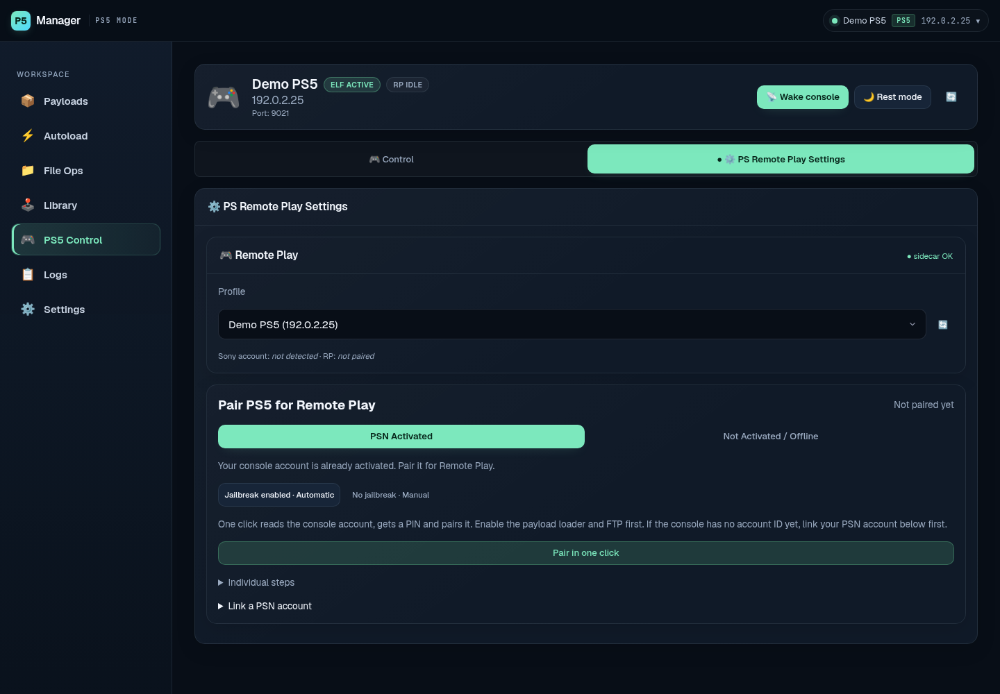
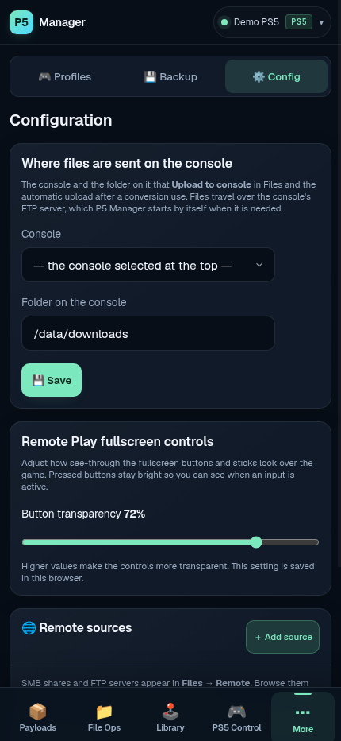

# P5 Manager

Manage a homebrew-enabled PS4 or PS5 from your browser. Send payloads, browse files, manage the console library, and use Remote Play on desktop or mobile.




P5 Manager is an independent hobby project and is not affiliated with Sony Interactive Entertainment. It contains no console exploit or game content. Use it only with consoles and files you are authorized to use. See [LEGAL.md](LEGAL.md).

## Features

- **Console control:** wake and manage PS4 and PS5 consoles, pair Remote Play, and control them with an on-screen controller or reusable Input Scripts.
- **Payloads and automation:** organize, update, and send payloads; build Autoload sequences that run manually or automatically when configured conditions are met.
- **File Ops:** browse local, network, and console storage; transfer files and run supported install, download, extract, and conversion tasks.
- **Library:** view and manage titles detected by ShadowMountPlus. Available actions depend on the console.
- **Mobile-ready:** responsive layout and installable PWA.

## Screenshots

| File manager | Remote Play pairing |
|---|---|
|  |  |

| Payloads | Settings on mobile |
|---|---|
|  |  |

## Requirements

- A PS4 or PS5 with a compatible homebrew setup, on the same network as P5 Manager.
- **PS5:** system software 13.60 or lower. **PS4:** a system software version supported by your homebrew setup.
- **Docker on Linux** (recommended) or **Windows 10/11** (portable package).
- Remote Play pairing requires a console account. For the Library, run [ShadowMountPlus](https://github.com/drakmor/ShadowMountPlus) on the console.

## Install

### Docker

```bash
git clone https://github.com/quatrixone/p5-manager.git
cd p5-manager
docker compose up -d
```

Open `http://<server-address>:3001`. Docker Compose starts the app and its Remote Play service. To update, run `git pull && docker compose pull && docker compose up -d`.

### Windows

Download **P5Manager-windows-x64.zip** from the [latest release](https://github.com/quatrixone/p5-manager/releases/latest), extract it, and start `P5Manager.exe`. The package includes its required runtimes and tools. Allow network access through Windows Firewall when prompted.

## First steps

1. Open **Settings → Profiles** and add your console, or use **Find consoles**.
2. Pair Remote Play once under **Console → PS Remote Play Settings**.
3. Choose the console profile, then send a payload or browse files.

The app can update its own code when the release is compatible with the installed image. If it asks for a newer Docker image, run `docker compose pull && docker compose up -d` from the project directory.

## Development

The app has three services: the Node API, the Vite frontend, and the Python Remote Play sidecar. The sidecar needs the `p5rp` helper; build it once from the repository root. On Debian or Ubuntu, install its build dependencies first:

```bash
sudo apt-get update
sudo apt-get install -y build-essential cmake ninja-build pkg-config \
  libjson-c-dev libminiupnpc-dev libevent-dev libssl-dev \
  python3-protobuf protobuf-compiler
cmake -S rpnative -B build-rp -G Ninja -DCMAKE_BUILD_TYPE=Release
cmake --build build-rp --target p5rp
python3 -m venv pyremoteplay/.venv
pyremoteplay/.venv/bin/pip install -r pyremoteplay/requirements.txt
```

Start each service in its own terminal from the repository root:

```bash
cd backend && npm ci && npm run dev
```

```bash
cd frontend && npm ci && npm run dev
```

```bash
P5RP_BIN="$PWD/build-rp/p5rp" \
PYREMOTEPLAY_SIDECAR_HOST=127.0.0.1 \
PYREMOTEPLAY_SIDECAR_PORT=9555 \
pyremoteplay/.venv/bin/python pyremoteplay/server.py
```

Open the frontend at `http://localhost:3000`. Vite forwards API requests to the backend on port `3001`; the sidecar listens on `127.0.0.1:9555`. The sidecar is needed for Remote Play; the API and frontend can be developed without it. Run tests with `npm test` in both `backend/` and `frontend/`. For Windows helper builds and contribution guidance, see [`rpnative/README.md`](rpnative/README.md) and [CONTRIBUTING.md](CONTRIBUTING.md).

## Credits and licences

P5 Manager builds on work from [chiaki-ng](https://github.com/streetpea/chiaki-ng), [ShadowMountPlus](https://github.com/drakmor/ShadowMountPlus), [zftpd](https://github.com/seregonwar/zftpd), [kstuff-lite](https://github.com/EchoStretch/kstuff-lite), and other homebrew developers. The Remote Play helper in [`rpnative/`](rpnative/) is licensed under AGPL-3.0. See [LEGAL.md](LEGAL.md) for third-party notices and intended use.

The application is MIT-licensed; some bundled components have separate licences. See [LICENSE](LICENSE) and [LEGAL.md](LEGAL.md).
