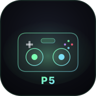
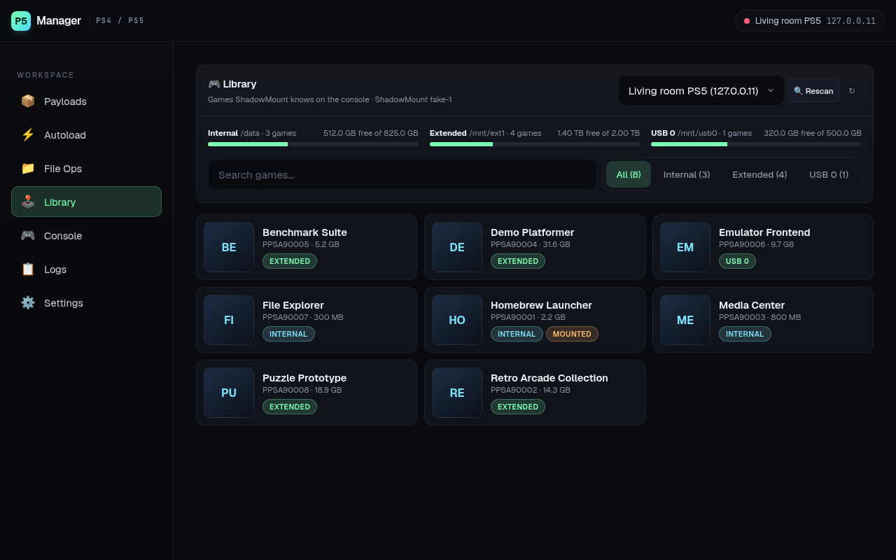
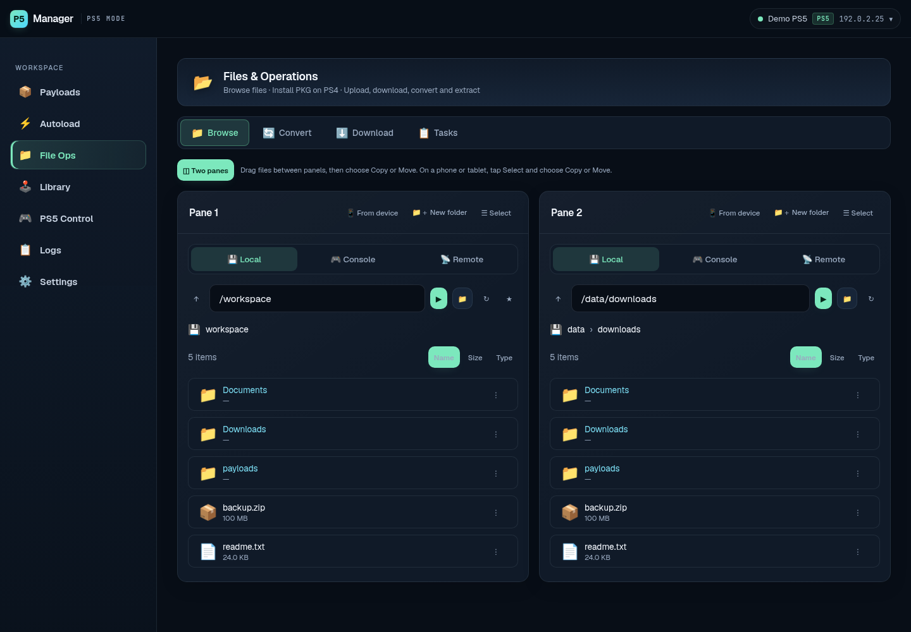
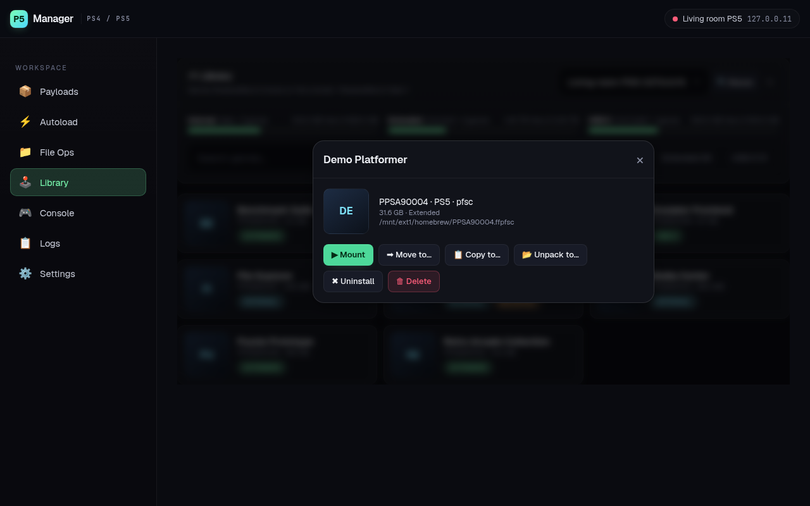
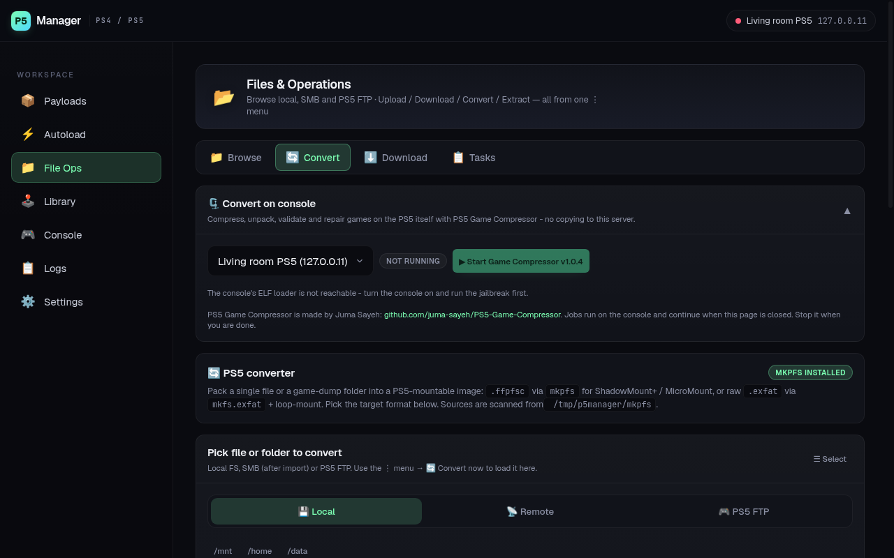
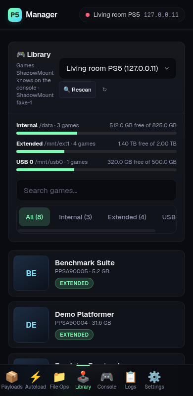

# P5 Manager



A web app for managing a PS4 or PS5 that runs homebrew. Send payloads, move
and convert files, browse the installed library and use Remote Play, all
from one browser tab on your PC or phone.

<br clear="left" />

> Independent hobby project, not affiliated with or endorsed by Sony
> Interactive Entertainment. For use with a console you own and files you
> have the right to use. See [LEGAL.md](LEGAL.md).




---

## Contents

- [What it does](#what-it-does)
- [Screenshots](#screenshots)
- [What you need](#what-you-need)
- [Install](#install)
- [First steps](#first-steps)
- [Jailbreak by itself after a restart](#jailbreak-by-itself-after-a-restart)
- [Ports](#ports)
- [How it is built](#how-it-is-built)
- [Development](#development)
- [Credits](#credits)
- [Legal](#legal)

---

## What it does

| Tab | What you can do there |
|-----|-----------------------|
| **Payloads** | Keep a library of payloads (`.elf`, `.lua`, `.bin`), fetch them from a GitHub release, check for updates and send one to the console with a click. |
| **Autoload** | Build a sequence of steps (wake the console, run a button script, wait for a port, send a payload, download, extract, convert, upload) and run it as one action - or let it start by itself when the console is on but not jailbroken. |
| **File Ops** | Browse this computer, a network share and the console side by side. Drag files between two panes to copy or move them, upload from your device, download from a URL, convert and extract. Long jobs run in a queue you can pause and resume. |
| **Library** | See every title ShadowMountPlus knows on the console, with icon, size and the drive it is on. Mount, move, copy, unpack, uninstall or delete a title, with a progress bar for the long ones. |
| **Console** | Remote Play in the browser: wake the console, see the screen, use an on-screen controller, record and replay button sequences, send a payload without leaving the view. The tab is named *PS5 Control* or *PS4 Control* once your default profile is one of those. |
| **Logs** | Live log streams from the console. |
| **Settings** | Console profiles, backup and restore, defaults, restart. |

Highlights:

- **Two-pane file manager.** Console on one side, your disk on the other
  (or the console on both). Transfers run on the server, so you can close
  the browser.
- **Convert on the console.** Start
  [PS5 Game Compressor](https://github.com/juma-sayeh/PS5-Game-Compressor)
  from **File Ops → Convert** and use it inside the app. Nothing is copied
  to the server.
- **Convert on the server.** Pack a file or folder into `.ffpfsc` (via
  `mkpfs`) or `.exfat`, and unpack them again.
- **Works on a phone.** The layout adapts to small screens and can be
  installed as an app (PWA).

---

## Screenshots

| File manager with two panes | A title in the Library |
|---|---|
|  |  |

| Convert | Library on a phone |
|---|---|
|  |  |

The screenshots use made-up demo data.

---

## What you need

- A PS4 or PS5 that already runs homebrew, on the same network as the
  computer running P5 Manager. P5 Manager contains no exploit and does not
  unlock a console by itself; it can only press the buttons that start the
  jailbreak you already use (see
  [Jailbreak by itself after a restart](#jailbreak-by-itself-after-a-restart)).
  - **PS5:** system software **13.60 or lower**.
  - **PS4:** a system software version your homebrew setup supports.
- For the **Library** tab:
  [ShadowMountPlus](https://github.com/drakmor/ShadowMountPlus) running on
  the console. It is one of the built-in payloads, and the Library can
  start it for you.
- For browsing the console's files: an FTP payload such as
  [zftpd](https://github.com/seregonwar/zftpd). On a PS5, P5 Manager
  starts it for you if it is in your payload library.
- One of:
  - **Docker** on Linux (recommended, all features), or
  - **Windows 10 / 11** for the portable version (no Docker needed).

---

## Install

### Docker

```bash
git clone https://github.com/quatrixone/p5-manager.git
cd p5-manager
docker compose up -d
```

Open `http://<this-computer>:3001`.

`docker compose up -d` pulls the published images. To build from source
instead, run `docker compose up -d --build`.

Two containers start, both with host networking so finding, waking and
Remote Play of the console work without port forwarding:

| Service        | What it is                                             |
|----------------|--------------------------------------------------------|
| `app`          | The web app and its API                                |
| `pyremoteplay` | The Remote Play service the app talks to               |

Your data survives updates. The database is in `./data/`; payloads,
downloads and conversion work files are in `/data/payloads`,
`/data/downloads` and `/data/mkpfs` on the host. To update: `git pull &&
docker compose pull && docker compose up -d`.

**Update from inside the app.** When a newer release is out, the app shows
a bar with **Update** and *What's new*. Update downloads the new version of
the app's own code from the release, checks it against the published
checksum, stores it in the data folder and restarts. The container itself
is not replaced and the app needs no access to Docker. If the new version
does not start, the app goes back to the one that ran before.

The container has to be allowed to restart for this: the provided
`docker-compose.yml` uses `restart: unless-stopped`.

Docker and the Windows package each get their own update bundle with every
release, and an installation only ever takes the one for its platform. The
bundles are not among a release's downloads: they are kept in a separate
release named
[Update bundles](https://github.com/quatrixone/p5-manager/releases/tag/updates),
which only the app reads.

What an in-app update cannot change in Docker is the image underneath:
system tools, the Node runtime, the installed libraries and the Remote Play
service (its own image). When a release needs a newer image, the bar says so
instead of offering Update; then use `git pull && docker compose pull &&
docker compose up -d`.

### Windows (portable)

1. Download `P5Manager-windows-x64.zip` from the
   [latest release](https://github.com/quatrixone/p5-manager/releases/latest).
2. Extract the whole zip anywhere.
3. Double-click `P5Manager.exe`. A console window opens (that is the app)
   and your browser opens `http://localhost:3001/`. The first start unpacks
   the app's files from `P5Manager.pak`, which takes a moment.

Allow `node.exe` and `python.exe` through Windows Firewall on private
networks when asked. Your data is kept in the `data` folder next to the
exe. Close the console window to stop the app.

The **Update** bar works here too, with a bundle made for the Windows
package: it also brings the newer Remote Play service. When a release needs
a newer package (other bundled runtimes or libraries), the bar says so;
download the new zip, extract it elsewhere and move your `data` folder
into it.

One thing works only in the Docker version: "remote source" SMB shares
(on Windows, type the `\\server\share` path into the Local file browser
instead).

---

## First steps

1. **Settings → Profiles**: press **Find consoles**. Every PS4 / PS5 that
   is on or in rest mode on your network is listed; press **+ Add** next
   to yours. Nothing to type in. Each console address can have one
   profile.
2. **Payloads**: the built-in set (ShadowMountPlus, kstuff-lite, a log
   server and a few more) is downloaded from its authors on first start.
   Add your own with **+ Add**.
3. **File Ops → Browse**: turn on **Two panes**, pick *Local* on one side
   and *Console* on the other, and drag a file across.
4. **Library**: pick the console. If ShadowMountPlus is not running, the
   page offers to start it.
5. **Console**: pair Remote Play once under **PS Remote Play Settings**,
   then press **Start session**. It wakes the console first if it is in
   rest mode.

---

## Jailbreak by itself after a restart

After a restart a console is not jailbroken until its exploit has run
again. P5 Manager can start that for you: the Autoload template **"PS5:
Jailbreak when the loader is down"** watches the console and, when it is
switched on while the payload loader port (9021) is closed, opens the
**User's Guide** through Remote Play, waits for the loader, then sends
`kstuff.elf` and `shadowmountplus.elf`.

This works only if the User's Guide on your console opens a jailbreak page
instead of Sony's manual. That is done with the console's DNS setting, not
by P5 Manager:

1. On the PS5: **Settings → Network → Settings → Set Up Internet
   Connection**, highlight your connection, press **Options**, then
   **Advanced Settings → DNS Settings → Manual**.
2. Set **Primary DNS** to a DNS server that points
   `manuals.playstation.net` at a jailbreak host. The author's console uses
   **`45.56.67.85`**; with it the User's Guide opens the jailbreak page and
   the loader comes up by itself.
3. Open the User's Guide once by hand (Settings → Guide & Tips, Health and
   Safety, and Other Information → User's Guide) and check that the loader
   starts before relying on the sequence.

Things to know:

- Such a DNS server is run by a third party. It answers every lookup your
  console makes and also blocks Sony's own addresses, so the console has
  no PlayStation Network while it is set. Use one you trust.
- Remote Play has to be paired (**Console → PS Remote Play Settings**),
  because the sequence presses the buttons through it.
- In **Autoload**, load the template, pick your console and save. Under
  **When it runs → Loader down** you can change how often the console is
  checked, which port is watched, how long it has to stay closed and the
  pause after a run.
- While a sequence is running, the Console tab is locked so your own
  presses do not land in the middle of it.

---

## Ports

Open on the computer running P5 Manager:

| Port | Proto | What                                             |
|------|-------|--------------------------------------------------|
| 3001 | TCP   | Web app and API                                  |
| 9555 | TCP   | Remote Play service (`127.0.0.1` only)           |
| 8080 | UDP   | Log receiver                                     |
| 3232 | TCP   | Kernel log receiver                              |
| 9303 | UDP   | Replies from consoles when searching for them    |

On the console, P5 Manager connects to:

| Port        | Proto | What                                        |
|-------------|-------|---------------------------------------------|
| 9021 / 9026 | TCP   | PS5 payload loader (ELF / Lua)              |
| 9020        | TCP   | PS4 payload loader                          |
| 2120 / 2121 | TCP   | FTP on a PS5 / PS4 (set per console in its profile) |
| 10101       | TCP   | ShadowMountPlus                             |
| 5910        | TCP   | PS5 Game Compressor                         |
| 9302 / 987  | UDP   | Finding and waking a PS5 / PS4              |
| 9295        | TCP   | Remote Play session                         |
| 9296        | UDP   | Remote Play video and input                 |

---

## How it is built

- **Backend**: Node.js and Express, SQLite through `sql.js`, `basic-ftp`.
  It calls `mkpfs`, `mkfs.exfat`, `7z` and `smbclient` for conversions and
  network shares.
- **Frontend**: React 18 and Vite, installable as a PWA.
- **Remote Play service**: Python 3.11 and FastAPI, with `p5rp`
  ([`rpnative/`](rpnative/), AGPL-3.0) - a small helper on
  [libchiaki](https://github.com/streetpea/chiaki-ng) that holds the
  session. The picture goes to the browser over WebRTC as the console
  encoded it (H.264 and Opus, sent by the backend through
  `node-datachannel`), or as MJPEG where WebRTC is not available.
- **Windows build**: the same code with a private Node and Python runtime
  and a small launcher, built and tested by
  [GitHub Actions](.github/workflows/windows-portable.yml).

Three small payloads live under [`p5managerclient/`](p5managerclient/)
and build with the
[ps5-payload-dev SDK](https://github.com/ps5-payload-dev/sdk):
`rp-get-pin.elf` (Remote Play pairing PIN, a patched copy of
[idlesauce's](https://github.com/idlesauce/ps5-remoteplay-get-pin)),
`offact.elf` (account ID for Remote Play pairing, derived from
[ps5-payload-dev/offact](https://github.com/ps5-payload-dev/offact),
GPL-3.0-or-later) and `pkg-install.elf` (package install queue, written
for this project). See [LEGAL.md](LEGAL.md) for their licences.

---

## Development

```bash
cd backend  && npm install && npm run dev   # API on :3001
cd frontend && npm install && npm run dev   # UI on :3000
cd pyremoteplay && pip install -r requirements.txt && python server.py
# the service needs p5rp: build rpnative/ (see rpnative/README.md) and put
# it on the PATH or point P5RP_BIN at it
```

Tests: `npm test` in `backend/` and in `frontend/`. An end-to-end check
against a running instance: `node scripts/smoke.mjs http://127.0.0.1:3001
/tmp/p5m-smoke`.

Contributions are welcome; please read [CONTRIBUTING.md](CONTRIBUTING.md)
first.

---

## Credits

This project glues together a lot of independent scene work. Star their
repos:

- [PSBrew / MkPFS](https://github.com/PSBrew/MkPFS) — `mkpfs`,
  PFS packer/unpacker driving the `.ffpfsc` modes
- [kerrdec97 / ps5-exfat-builder](https://github.com/kerrdec97/ps5-exfat-builder)
  — Windows-side reference for the exFAT image pipeline
- [ps5-payload-dev / sdk](https://github.com/ps5-payload-dev/sdk) —
  SDK every in-tree PS5 ELF builds against
- [ps5-payload-dev / offact](https://github.com/ps5-payload-dev/offact)
  (John Törnblom) — the code `offact.elf` is derived from
- [idlesauce / ps5-remoteplay-get-pin](https://github.com/idlesauce/ps5-remoteplay-get-pin)
  — the code `rp-get-pin.elf` is a patched copy of
- [streetpea / chiaki-ng](https://github.com/streetpea/chiaki-ng) —
  libchiaki, the Remote Play protocol library `p5rp` is built on
- [ktnrg45 / pyremoteplay](https://github.com/ktnrg45/pyremoteplay) —
  the Remote Play library the service was first built on; paired consoles
  keep its profile layout
- [gezine](https://github.com/gezine) — Luac0re, whose `setlogserver.lua`
  is the Lua log redirector behind the Logs tab
- **flatz** + **CelesteBlue** — original public-domain `unpkg.py` and
  the Python 3 port vendored as `backend/src/lib/unpkg.py`
- **etaHEN team** — etaHEN
- **GoldHEN team** (sleirsgoevy et al.) — PS4 GoldHEN payload
- [drakmor / ShadowMountPlus](https://github.com/drakmor/ShadowMountPlus) —
  the API behind the Library tab
- [seregonwar / zftpd](https://github.com/seregonwar/zftpd) — FTP server
  and on-console downloader used by File Ops and Download
- [EchoStretch / kstuff-lite](https://github.com/EchoStretch/kstuff-lite) —
  built-in payload
- [juma-sayeh / PS5-Game-Compressor](https://github.com/juma-sayeh/PS5-Game-Compressor)
  — on-console compression, started from File Ops → Convert

If you should be credited and aren't, please open an issue.

---

## Legal

Not affiliated with Sony Interactive Entertainment; "PlayStation", "PS4"
and "PS5" are its trademarks. This repository contains no Sony code,
firmware or keys and no game content, and third-party tools are fetched
from their authors rather than redistributed here. The project does not
support piracy. Details, intended use and how to report a content problem:
[LEGAL.md](LEGAL.md).

## License

[MIT](LICENSE), except `p5managerclient/offact/` (GPL-3.0-or-later) and
`p5managerclient/rp-get-pin/` (third-party, no licence stated upstream).
Details in [LEGAL.md](LEGAL.md).
